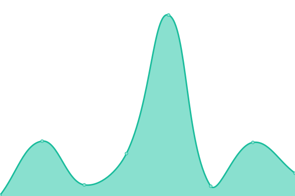

# [📈 Live Status](https://mcmod-info-mirror.github.io/status): <!--live status--> **🟧 Partial outage**

This repository contains the open-source uptime monitor and status page for [mcmod-info-mirror](https://mcmod-info-mirror.github.io/status), powered by [Upptime](https://github.com/upptime/upptime).

With [Upptime](https://upptime.js.org), you can get your own unlimited and free uptime monitor and status page, powered entirely by a GitHub repository. We use [Issues](https://github.com/mcmod-info-mirror/status/issues) as incident reports, [Actions](https://github.com/mcmod-info-mirror/status/actions) as uptime monitors, and [Pages](https://mcmod-info-mirror.github.io/status) for the status page.

<!--start: status pages-->
<!-- This summary is generated by Upptime (https://github.com/upptime/upptime) -->
<!-- Do not edit this manually, your changes will be overwritten -->
<!-- prettier-ignore -->
| URL | Status | History | Response Time | Uptime |
| --- | ------ | ------- | ------------- | ------ |
|  [root](https://mod.mcimirror.top) | 🟩 Up | [root.yml](https://github.com/mcmod-info-mirror/status/commits/HEAD/history/root.yml) | 

 1047ms
     
 | 

<a href="https://status.mcimirror.top/history/root">97.98%</a>
    

|  [docs](https://mod.mcimirror.top/docs) | 🟩 Up | [docs.yml](https://github.com/mcmod-info-mirror/status/commits/HEAD/history/docs.yml) | 

 208ms
     
 | 

<a href="https://status.mcimirror.top/history/docs">97.99%</a>
    

|  [Curseforge Search](https://mod.mcimirror.top/v1/curseforge/mods/search?gameId=432&pageSize=50) | 🟩 Up | [curseforge-search.yml](https://github.com/mcmod-info-mirror/status/commits/HEAD/history/curseforge-search.yml) | 

 659ms
     
 | 

<a href="https://status.mcimirror.top/history/curseforge-search">97.99%</a>
    

|  [Curseforge Mod](https://mod.mcimirror.top/v1/curseforge/mods/238222) | 🟩 Up | [curseforge-mod.yml](https://github.com/mcmod-info-mirror/status/commits/HEAD/history/curseforge-mod.yml) | 

 224ms
     
 | 

<a href="https://status.mcimirror.top/history/curseforge-mod">97.99%</a>
    

|  [Curseforge Files](https://mod.mcimirror.top/v1/curseforge/mods/238222/files) | 🟩 Up | [curseforge-files.yml](https://github.com/mcmod-info-mirror/status/commits/HEAD/history/curseforge-files.yml) | 

 846ms
     
 | 

<a href="https://status.mcimirror.top/history/curseforge-files">98.00%</a>
    

|  [Modrinth Search](https://mod.mcimirror.top/v1/modrinth/search?offset=0&limit=10&index=relevance) | 🟩 Up | [modrinth-search.yml](https://github.com/mcmod-info-mirror/status/commits/HEAD/history/modrinth-search.yml) | 

 316ms
     
 | 

<a href="https://status.mcimirror.top/history/modrinth-search">98.00%</a>
    

|  [Modrinth Project](https://mod.mcimirror.top/v1/modrinth/project/sodium-extra) | 🟩 Up | [modrinth-project.yml](https://github.com/mcmod-info-mirror/status/commits/HEAD/history/modrinth-project.yml) | 

 278ms
     
 | 

<a href="https://status.mcimirror.top/history/modrinth-project">98.01%</a>
    

|  [Modrinth Versions](https://mod.mcimirror.top/v1/modrinth/project/sodium-extra/version) | 🟩 Up | [modrinth-versions.yml](https://github.com/mcmod-info-mirror/status/commits/HEAD/history/modrinth-versions.yml) | 

 545ms
     
 | 

<a href="https://status.mcimirror.top/history/modrinth-versions">98.01%</a>
    

|  [Modrinth Single Version](https://mod.mcimirror.top/v1/modrinth/version/3JJvf9Kn) | 🟥 Down | [modrinth-single-version.yml](https://github.com/mcmod-info-mirror/status/commits/HEAD/history/modrinth-single-version.yml) | 

 175ms
     
 | 

<a href="https://status.mcimirror.top/history/modrinth-single-version">0.54%</a>
    

|  [Modrinth hash](https://mod.mcimirror.top/v1/modrinth/version_file/acac3670ee25cc10ed63136e5dd3b792acd13595) | 🟥 Down | [modrinth-hash.yml](https://github.com/mcmod-info-mirror/status/commits/HEAD/history/modrinth-hash.yml) | 

 185ms
     
 | 

<a href="https://status.mcimirror.top/history/modrinth-hash">4.43%</a>
    

<!--end: status pages-->

[**Visit our status website →**](https://mcmod-info-mirror.github.io/status)

## 📄 License

- Powered by: [Upptime](https://github.com/upptime/upptime)
- Code: [MIT](./LICENSE) © [Anand Chowdhary](https://anandchowdhary.com), supported by [Pabio](https://pabio.com)
- Data in the `./history` directory: [Open Database License](https://opendatacommons.org/licenses/odbl/1-0/)
