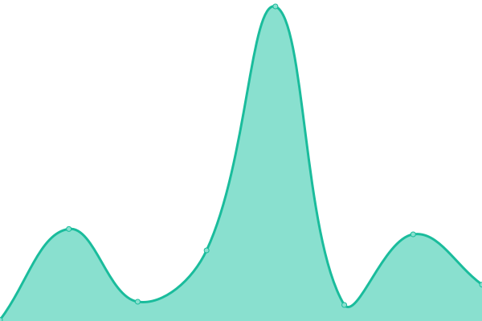
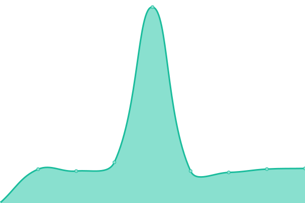

# [📈 Live Status](https://mcmod-info-mirror.github.io/status): <!--live status--> **🟧 Partial outage**

This repository contains the open-source uptime monitor and status page for [mcmod-info-mirror](https://mcmod-info-mirror.github.io/status), powered by [Upptime](https://github.com/upptime/upptime).

With [Upptime](https://upptime.js.org), you can get your own unlimited and free uptime monitor and status page, powered entirely by a GitHub repository. We use [Issues](https://github.com/mcmod-info-mirror/status/issues) as incident reports, [Actions](https://github.com/mcmod-info-mirror/status/actions) as uptime monitors, and [Pages](https://mcmod-info-mirror.github.io/status) for the status page.

<!--start: status pages-->
<!-- This summary is generated by Upptime (https://github.com/upptime/upptime) -->
<!-- Do not edit this manually, your changes will be overwritten -->
<!-- prettier-ignore -->
| URL | Status | History | Response Time | Uptime |
| --- | ------ | ------- | ------------- | ------ |
|  [root](https://mod.mcimirror.top) | 🟩 Up | [root.yml](https://github.com/mcmod-info-mirror/status/commits/HEAD/history/root.yml) | 

 997ms
     
 | 

<a href="https://status.mcimirror.top/history/root">99.83%</a>
    

|  [docs](https://mod.mcimirror.top/docs) | 🟩 Up | [docs.yml](https://github.com/mcmod-info-mirror/status/commits/HEAD/history/docs.yml) | 

 235ms
     
 | 

<a href="https://status.mcimirror.top/history/docs">99.83%</a>
    

|  [Curseforge Search](https://mod.mcimirror.top/v1/curseforge/mods/search?gameId=432&pageSize=50) | 🟩 Up | [curseforge-search.yml](https://github.com/mcmod-info-mirror/status/commits/HEAD/history/curseforge-search.yml) | 

 487ms
     
 | 

<a href="https://status.mcimirror.top/history/curseforge-search">99.83%</a>
    

|  [Curseforge Mod](https://mod.mcimirror.top/v1/curseforge/mods/238222) | 🟩 Up | [curseforge-mod.yml](https://github.com/mcmod-info-mirror/status/commits/HEAD/history/curseforge-mod.yml) | 

 223ms
     
 | 

<a href="https://status.mcimirror.top/history/curseforge-mod">99.83%</a>
    

|  [Curseforge Single File](https://mod.mcimirror.top/v1/curseforge/mods/256717/files/2666198) | 🟩 Up | [curseforge-single-file.yml](https://github.com/mcmod-info-mirror/status/commits/HEAD/history/curseforge-single-file.yml) | 

 195ms
     
 | 

<a href="https://status.mcimirror.top/history/curseforge-single-file">100.00%</a>
    

|  [Curseforge Files](https://mod.mcimirror.top/v1/curseforge/mods/238222/files) | 🟩 Up | [curseforge-files.yml](https://github.com/mcmod-info-mirror/status/commits/HEAD/history/curseforge-files.yml) | 

 703ms
     
 | 

<a href="https://status.mcimirror.top/history/curseforge-files">99.83%</a>
    

|  [Curseforge Fingerprints](https://mod.mcimirror.top/v1/curseforge/fingerprints) | 🟩 Up | [curseforge-fingerprints.yml](https://github.com/mcmod-info-mirror/status/commits/HEAD/history/curseforge-fingerprints.yml) | 

 752ms
     
 | 

<a href="https://status.mcimirror.top/history/curseforge-fingerprints">100.00%</a>
    

|  [Modrinth Search](https://mod.mcimirror.top/v1/modrinth/search?offset=0&limit=10&index=relevance) | 🟩 Up | [modrinth-search.yml](https://github.com/mcmod-info-mirror/status/commits/HEAD/history/modrinth-search.yml) | 

 223ms
     
 | 

<a href="https://status.mcimirror.top/history/modrinth-search">99.83%</a>
    

|  [Modrinth Project](https://mod.mcimirror.top/v1/modrinth/project/sodium-extra) | 🟩 Up | [modrinth-project.yml](https://github.com/mcmod-info-mirror/status/commits/HEAD/history/modrinth-project.yml) | 

 325ms
     
 | 

<a href="https://status.mcimirror.top/history/modrinth-project">99.83%</a>
    

|  [Modrinth Versions](https://mod.mcimirror.top/v1/modrinth/project/sodium-extra/version) | 🟩 Up | [modrinth-versions.yml](https://github.com/mcmod-info-mirror/status/commits/HEAD/history/modrinth-versions.yml) | 

 274ms
     
 | 

<a href="https://status.mcimirror.top/history/modrinth-versions">99.83%</a>
    

|  [Modrinth Single Version](https://mod.mcimirror.top/v1/modrinth/version/3JJvf9Kn) | 🟩 Up | [modrinth-single-version.yml](https://github.com/mcmod-info-mirror/status/commits/HEAD/history/modrinth-single-version.yml) | 

 207ms
     
 | 

<a href="https://status.mcimirror.top/history/modrinth-single-version">96.53%</a>
    

|  [Modrinth hash](https://mod.mcimirror.top/v1/modrinth/version_file/acac3670ee25cc10ed63136e5dd3b792acd13595) | 🟩 Up | [modrinth-hash.yml](https://github.com/mcmod-info-mirror/status/commits/HEAD/history/modrinth-hash.yml) | 

 230ms
     
 | 

<a href="https://status.mcimirror.top/history/modrinth-hash">97.20%</a>
    

|  [Modrinth file cdn](https://mod.mcimirror.top/data/P7dR8mSH/versions/Y0cpssyN/fabric-api-0.100.6%2B1.21.jar) | 🟥 Down | [modrinth-file-cdn.yml](https://github.com/mcmod-info-mirror/status/commits/HEAD/history/modrinth-file-cdn.yml) | 

 4628ms
     
 | 

<a href="https://status.mcimirror.top/history/modrinth-file-cdn">96.65%</a>
    

|  [Curseforge file cdn](https://mod.mcimirror.top/files/5106/178/jei-1.19.2-forge-11.6.0.1019.jar) | 🟩 Up | [curseforge-file-cdn.yml](https://github.com/mcmod-info-mirror/status/commits/HEAD/history/curseforge-file-cdn.yml) | 

 1367ms
     
 | 

<a href="https://status.mcimirror.top/history/curseforge-file-cdn">94.20%</a>
    

<!--end: status pages-->

[**Visit our status website →**](https://mcmod-info-mirror.github.io/status)

## 📄 License

- Powered by: [Upptime](https://github.com/upptime/upptime)
- Code: [MIT](./LICENSE) © [Anand Chowdhary](https://anandchowdhary.com), supported by [Pabio](https://pabio.com)
- Data in the `./history` directory: [Open Database License](https://opendatacommons.org/licenses/odbl/1-0/)
